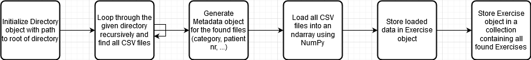
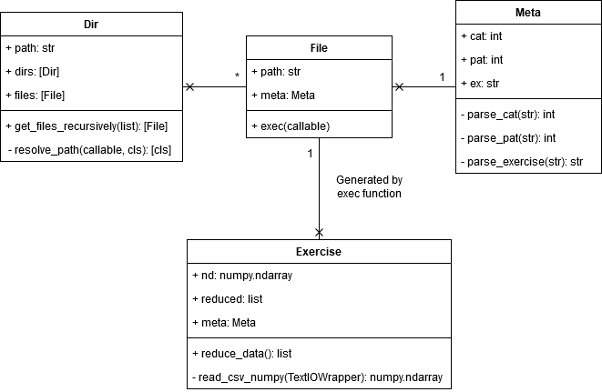
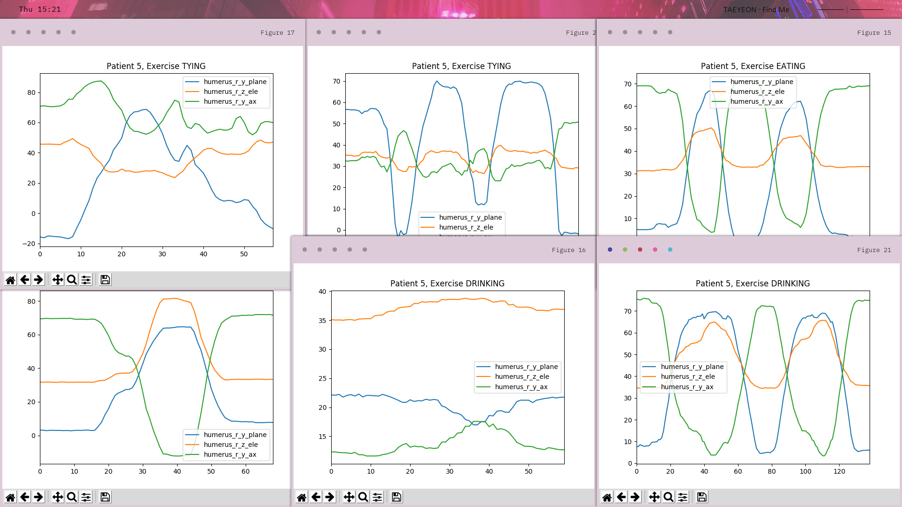
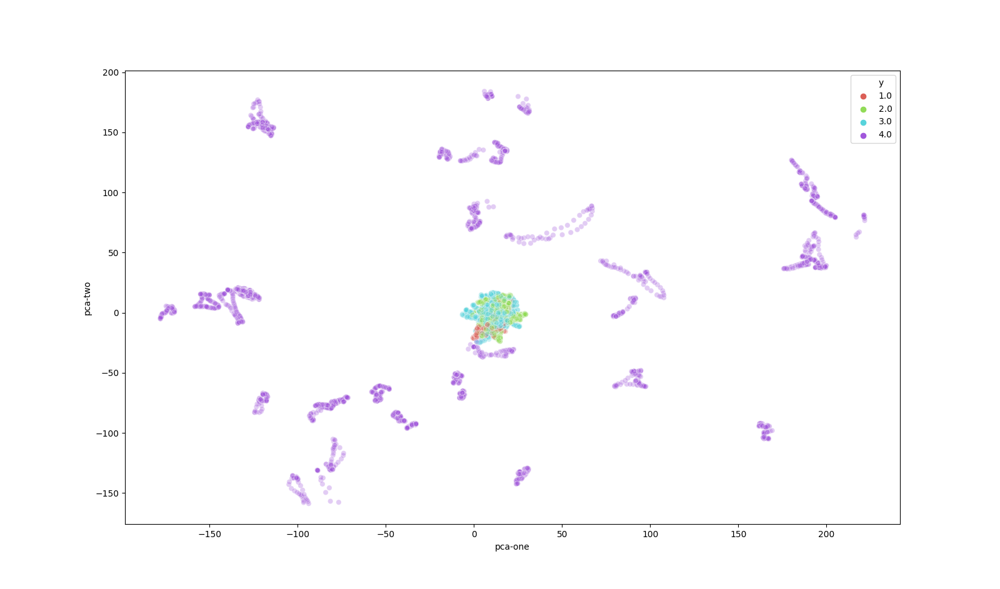
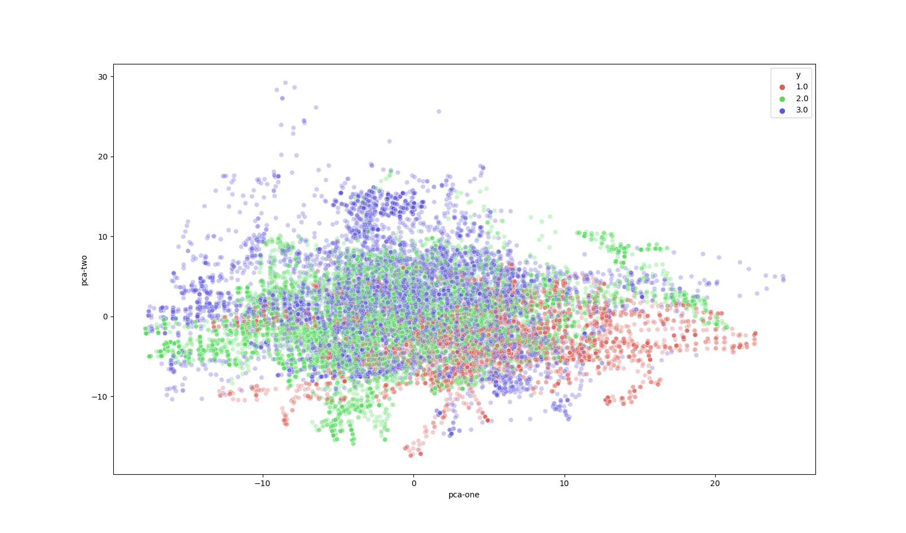
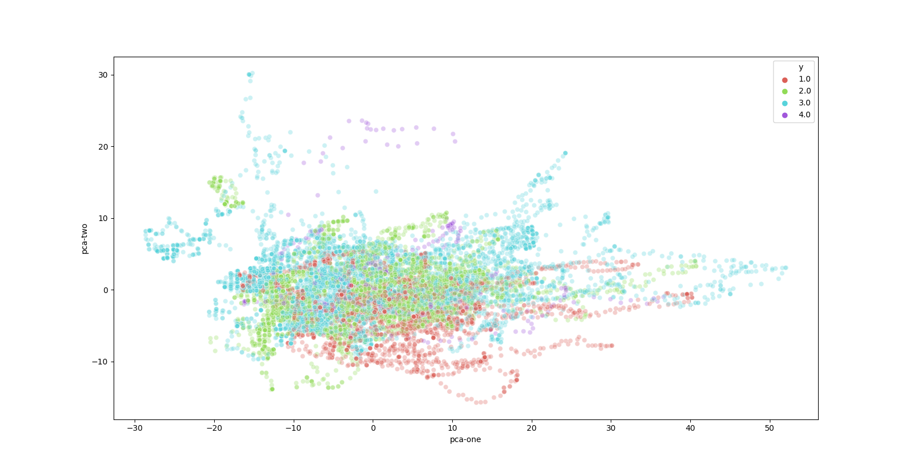
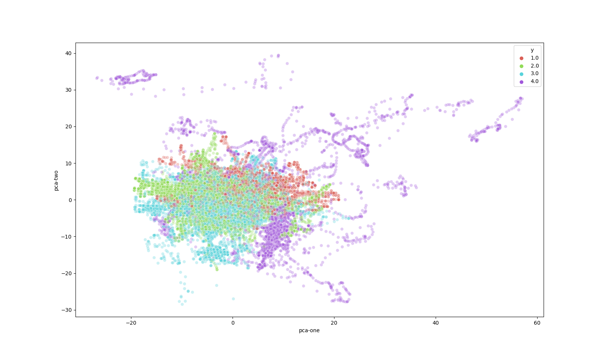
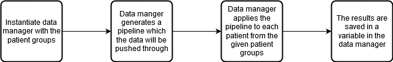
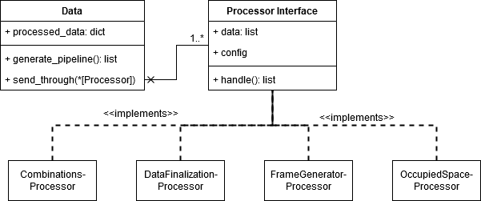
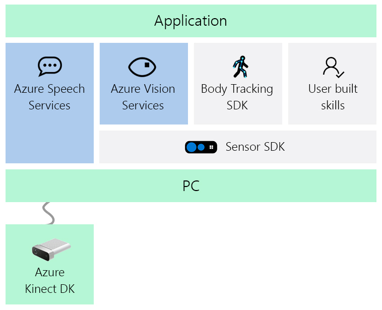

# DataScience
Arjun Sardjoe Missier - 15052907
Minor: ITD-KB-74-1-18

## Introduction
This portfolio describes my achievements as well as my contributions towards the project. 

The project in question is the ortho eyes project within the minor data science 19/20. During this minor we will 
create a classifier to diagnose in which category a patient's shoulder disability should be placed. This project 
will be fulfilled in a group of seven students working together with the LUMC. They are looking for a product 
to assist their physicians in diagnosing these shoulder disabilities. Furthermore they've provided the data set 
on which we're training and generating predictions.

Based on this information we formulated our research question to be as follows 
>_"To what extend and in what way, can different supervised data science techniques be used on kinematic recordings to contribute to a more valid and more reliable diagnosis, made by a doctor, on shoulder disability."_

The sub questions are set up as follows
> - What datascience techniques should we use? 
> - How can kinematic recordings be reshaped(organized) into a valid/reliable data set. 
> - What other datascience techniques could we use and (how) can they improve the classification 
> - What parts of the kinematic recordings are contributing? 
> - Do we validate the reliability of the diagnosis the Datacience techniques made. 
> - How is our outcome contributing to the medical domain?(classification/research) 

## Table of contents
- [Datacamp](#datacamp)
- [Data set](#data-set)
    - [Labels](#labels)
    - [Raw data](#raw-data)
    - [Conversion](#conversion)
    - [Converted data](#converted-data)
- [Reproducing results](#reproducing-results)
- [Model choice](#model)
    - [Choice explanation](#why)
    - [Model configuration](#model-configuration)
    - [Evaluation](#model-evaluation)
- [Contributions](#contributions)
    - [Data conversion](#data-conversion)
        - [Matlab script](#matlab-script)
        - [Free movement exercises](#free-movement-exercises)
        - [Skipped patients](#skipped-patients)
        - [Patient group 4](#patient-group-4)
            - [Different measurement units](#different-measurement-units)
            - [Calibration file](#calibration-file)
            - [Dummy data](#dummy-data)
        - [Data verification](#data-verification)
    - [Data manager](#data-manager)
        - [Processors](#processors)
    - [Split manager](#split-manager)
    - [CNN data generation](#cnn-data-generation)
    - [Paper](#paper)
- [Results](#results)
- [Evaluation](#evaluation)
- [Conclusion](#conclusion)
- [Proof of contribution](#proof-of-contribution)
- [Bibliography](#bibliography)
- [Presentations](#presentations)
- [Reflections](#reflections)

## Datacamp
A complete overview of all datacamp proof of accomplishments can be found [here](resources/datacamp). For completion all 
completed assignments will be listed below in order of due date.
- [Introduction to python](resources/datacamp/introduction_to_python.pdf)
- [Introduction and flat files*](resources/datacamp/assignments_overview.png)
- [Customizing plots](resources/datacamp/introduction_to_data_visualization_with_python.pdf)
- [Intermediate python for data science](resources/datacamp/intermediate_python_for_data_science.pdf)
- [Pandas foundations](resources/datacamp/pandas_foundations.pdf)
- [Writing your own functions](resources/datacamp/python_data_science_toolbox_1.pdf)
- [Statistical plots with seaborn](resources/datacamp/introduction_to_data_visualization_with_python.pdf)
- [Plotting 2D arrays](resources/datacamp/introduction_to_data_visualization_with_python.pdf)
- [Python data science toolbox part 2](resources/datacamp/python_data_science_toolbox_2.pdf)
- [Cleaning data in python](resources/datacamp/cleaning_data_in_python.pdf)
- [Python data science toolbox part 1](resources/datacamp/python_data_science_toolbox_1.pdf)
> _* Only a few chapters had to be completed in order to comply with the requirements. As such no proof of 
completion is awarded. A screenshot of the completed courses is added instead_

## Data set
After visiting and talking to one of the physicians at the LUMC we left with the same, but better labeled data set. In 
this data set we could say with certainty which exercise a patient was performing. As opposed to the data set used 
by the project group last year. The only downside to the newly received data set is that we'd have to convert the 
data ourselves to euler angles in matlab using the provided scripts.

### Labels
The data set used by the previous group didn't contain a lot of certainty regarding the categorization of the exercises. 
Their set was categorized in patient groups, which contained the files for all patient within that category. However 
their exercises were anonymized, meaning they couldn't tell with certainty which exercise was being performed. To 
circumvent this they looped through each of the exercises, plotted it, and determined by hand in which self made 
category they could place it. This led them to five different exercises within their data set.

In our case we received raw data from the flock of birds system and have to convert them in matlab to euler angels. One 
of the advantages this data set has is the labeled exercises. We won't have to speculate about which exercise is being 
performed by a patient. As an added bonus we can visualize the raw data files to map out what a certain exercise 
looks like.

### Raw data
In our project we made a distinct division between the raw and converted (euler angle) data. The structure of 
our data set is as follows

    ├── Category_1
    │   ├── 1
    │   │   ├── AB1.csv
    │   │   ├── AB1.txt
    │   │   ├── AB2.csv
    │   │   ├── AB2.txt
    │   │   ├── AF1.csv
    │   │   ├── AF1.txt
    │   │   ├── AF2.csv
    │   │   ├── ...
    │   ├── ...
    ├── ...
>_data set structure_

    x y y y
      z z z
      z z z
      z z z
>_formatting of a sensor measurement_

Where 'x' is the sensor number, 'y' is a static value per patient, and 'z' forms a 3x3 matrix transcribing 
the patient's movement.

We've stored the raw and converted data in the same place. This is for the sake of simplicity and easy retrieval. We 
still use the raw data for visualizing the patient's movement.

### Conversion
The majority of the initial data conversion is done by [Eddie Versluis](https://github.com/v3rslu1s). Therefor I won't 
go into detail about it too much. I did however put the majority of the effort into 
[converting patient group 4](#patient-group-4) which will be discussed later in this portfolio.

### Converted data
The converted data with added header looks as follows

thorax_r_x_ext|thorax_r_y_ax|thorax_r_z_lat|clavicula_r_y_pro|clavicula_r_z_ele|clavicula_r_x_ax|scapula_r_y_pro|scapula_r_z_lat|scapula_r_x_tilt|humerus_r_y_plane|humerus_r_z_ele|humerus_r_y_ax|ellebooghoek_r|thorax_l_x_ext|thorax_l_y_ax|thorax_l_z_lat|clavicula_l_y_pro|clavicula_l_z_ele|clavicula_l_x_ax|scapula_l_y_pro|scapula_l_z_lat|scapula_l_x_tilt|humerus_l_y_plane|humerus_l_z_ele|humerus_l_y_ax|ellebooghoek_l
---|---|---|---|---|---|---|---|---|---|---|---|---|---|---|---|---|---|---|---|---|---|---|---|---|---
7.716094e+00|-3.462766e+00|-1.460404e+00|-1.630342e+01|1.095165e+01|-6.899586e+00|2.434166e+01|-1.062997e+01|-2.071014e+01|-3.373870e+01|1.394120e+01|5.210408e+01|3.976150e+02|7.716094e+00|3.462766e+00|1.460404e+00|-2.192275e+01|1.037888e+01|-7.964620e+00|1.938317e+01|-1.318752e+01|-1.907376e+01|-2.112837e+01|1.462810e+01|5.254767e+01|4.050066e+02
7.622684e+00|-3.447406e+00|-1.453711e+00|-1.644224e+01|1.135854e+01|-6.791136e+00|2.434561e+01|-1.060261e+01|-2.061820e+01|-3.266545e+01|1.382708e+01|5.088468e+01|3.969477e+02|7.622684e+00|3.447406e+00|1.453711e+00|-2.174569e+01|1.043017e+01|-7.904142e+00|1.941585e+01|-1.314481e+01|-1.898729e+01|-2.067755e+01|1.465190e+01|5.209330e+01|4.048996e+02
8.214207e+00|-2.937460e+00|-1.189491e+00|-1.610064e+01|1.172630e+01|-8.231244e+00|2.371940e+01|-1.118295e+01|-2.097882e+01|-3.633161e+01|1.378239e+01|5.398188e+01|3.997662e+02|8.214207e+00|2.937460e+00|1.189491e+00|-2.050971e+01|1.130783e+01|-8.994802e+00|1.979399e+01|-1.312111e+01|-1.962676e+01|-2.142451e+01|1.511340e+01|5.345148e+01|4.062212e+02
>_First three lines of category 1, patient 1, exercise AB_

One value in particular is quite strange - the elbow angle. In all the three data samples above it hovers around the 
400. This is pretty unbelievable since one would have to break his elbows to move it much further than 180 degrees. 
Even considering the euler angles it doesn't seem right compared to the data from the other sensors; The value is 
simply too big. We therefor decided to mostly ignore this value in our training and evaluation. 

## Reproducing results
Unlike the other groups we had an already quite promising result created by the group who worked on this project last 
year. Because of that we decided to do our best to factually and reliably reproduce their results before moving forward.
This was done by most members of the group individually to really understand what has been done to come to these 
results. The only difference between the two project groups is us using the labeled data received from the LUMC, in 
opposition to them using the unlabeled data set.

[My attempt](https://github.com/kiwigod/ortho) at this is possibly the fastest what's achieved within the current group. 
The way it's setup generates only one object, exercise, which warehouses all important data. I personally didn't see a 
need to create multiple objects like patient group and patient, since all this data can be retrieved by looping through 
the collection which contains these objects. For a complete overview of the overview of the data retrieval see the 
figures below

<details>
    <summary>diagrams</summary>


>_loading the files into memory_


>_uml diagram of data loading_
</details>
<br>

After loading all the data into memory we'd have to prepare it to feed it into a machine learning model. Since we were 
reproducing a result to verify it's integrity we went the same route for this as the previous group did. This meant 
picking five data points from the exercise's ndarray for every unique exercise combination, assuming the patient has 
performed all expected exercises. This will result one or more ndarrays with a length of 650 (samples * sample length * 
number of exercises = 5 * 26 * 5 = 650).

Finally the data can be split into a train and test set, and fed to the model. Training of the model took on average 
not longer than a minute. The results were in line with what we'd expect, however not as good as achieved by the 
project group from last year.

In verdict my approach in reproducing the results might have been the fastest, but it wasn't well understood by my 
peers with less computer programming experience. Therefor we decided to use a peer's project as base to build upon. 
His was easier to understand and produced results just as good.

## Model
During this project we've mostly used logistic regression. In this chapter a further explanation for why and how 
we've made use of this technique.

### Why
The main reason for why we picked logistic regression is because this was [used by the project group of last year](https://github.com/Lukelumia/Applied-Data-Science/blob/master/paper_ortho_eyes.pdf) 
as well. This is obviously not sufficient of a reason, they could've made a mistake.

The main reason the pick a classifier over a regression model is because we're trying to predict to which class 
a data point belongs to. Since we're working with more than two classes we've to resort to multivariate logistic 
regression.

### Model configuration
When initializing our machine learning model we've opted to use the following parameters. The explanations are 
retrieved from the [sklearn documentation](https://scikit-learn.org/stable/modules/generated/sklearn.linear_model.LogisticRegression.html)

Parameter | Value | Explanation | Reasoning
--- | --- | --- | ---
solver | lbgfs | For multiclass problems, only ‘newton-cg’, ‘sag’, ‘saga’ and ‘lbfgs’ handle multinomial loss; ‘liblinear’ is limited to one-versus-rest schemes. | Since we're dealing with a multiclass problem, we've opted for 'lbgfs'
max_iter | 2000 | Maximum number of iterations taken for the solvers to converge. | The default value is 100, but the solver didn't converge with that value. Raising this value removed the no converge warning
multi_class | auto | If the option chosen is ‘ovr’, then a binary problem is fit for each label. For ‘multinomial’ the loss minimised is the multinomial loss fit across the entire probability distribution, even when the data is binary. ‘multinomial’ is unavailable when solver=’liblinear’. ‘auto’ selects ‘ovr’ if the data is binary, or if solver=’liblinear’, and otherwise selects ‘multinomial’. | auto is the default value in sklearn, the other two options are 'ovr' and 'multinomial'. From the explanation we can conclude ovr cannot be used since the data isn't binary, neither have we set the solver to 'liblinear'. Thus auto sets the value to 'multinomial'

### Model evaluation
We evaluated the model using a train- and test-set split. This is done by randomly defining the patients per patient 
group in the configuration file, this will [generate the test-set](https://dev.azure.com/DataScienceMinor/Data%20Science/_git/Data%20Science/commit/7244b5d7b2f267c52d4ff5e5723d87904139e645). Testing the trained model with 
this set then returns several machine learning metrics, like accuracy, from which we can determine if the model is 
under- or overfitting.

## Contributions
We've tried several ideas and techniques to improve the results of the machine learning model. In this chapter I 
will elaborate further on the contributions I've made towards the project, and how they impacted the final product. 

## Data conversion
As stated earlier the data we received from the LUMC was raw sensor data output from the flock of birds sensor. This 
data still had to be converted to euler angels by us for them to be useful in our application. To do this I created a 
virtual machine running Ubuntu 19.10. During installation I opted for the minimal application option. Afterwards I 
installed "Matlab R2019b", created a shared folder for data conversion, which completed the setup for the data 
conversion.

### Matlab script
The first thing I had to do was understand how the matlab script operated. Since I never worked with matlab it was 
quite challenging. Eventually I figured out that most of the relevant processing is done within a file called 
"[dat2m_FV.m](resources/contributions/dat2m_FV.m)". This file calibrates the sensor data against a predefined 
calibration file. This calibration file is dependant on the room in which the system is located.

It seems there are two calibration files, presumably the flock of birds system was moved at some point. However 
we only received one calibration file. This could pose a problem since we don't know when the recordings of our data 
were made. We tried to contact the LUMC about this, but to no avail, they weren't able to clear this up. Thus we had 
to assume that the calibration file we received was the correct one. 

Furthermore when applying the calibration both the sensor data and calibration file must be presented in the same 
measurement unit. Because the calibration file is a static variable the script converts the sensor data from 
millimeters to inches — the measurement unit used in the calibration file. 

At the end of the script there's a flag which is enabled under conditions which aren't clear to me. Either way 
when this flag is enabled dummy data is filled for the sensors which aren't recorded. This sounds pretty strange 
to me, since it introduces variables which cannot be accounted for.

### Free movement exercises
In an ideal scenario the patient should freely move and the system gives a diagnostic of which category he/she 
belongs in. The data we received from the LUMC did contain some exercises which could be considered "free movement", 
for example tying shoelaces, drinking from a cup, etc.

These files were excluded from the initial conversion because we weren't sure if we wanted to use them. One argument 
against using this data could be how the exercise performed isn't "controlled". There's no quality control, because 
everyone might, and probably will, do a certain task ever so slightly different, even within one patient group.

Nevertheless I altered the Matlab script to take these exercises into account as well. This took a bit of tinkering, 
mainly because I wanted it to work once and for all without a specific directory structure. I however couldn't get 
it to work the way I wanted it to without sacrificing other tasks on the sprint, which wasn't worth it.


>_A 2D visualization of all axis belonging to the humerus of patient 5 in category 1_

Through observation of the visualization above we can conclude these exercises are not fit for usage in our approach. 
Look at the drinking exercises for example, even though it's the same patient, the graphs show wildly different 
movement. Therefor we haven't made use of these exercises beyond this point.

As stated in the beginning of this paragraph, the ideal scenario would be a patient moving and making a diagnosis. 
However with what we've determined now it'd be quite difficult to achieve if there are no set of exercises the 
patient must perform.

### Skipped patients
It seemed that during the initial conversion some patient were left out of the conversion. This wasn't intended, thus 
a bug in the Matlab script. I took the task upon myself to convert these remaining patients and add them to the 
converted data set.

Initially I tried to just run the script again, because at first glace there was no reason for it to skip over these 
patients. Sadly this didn't work, and I was forced to try something else. As is apparent by now I'm by no means an 
expert in Matlab, and I don't intend to be. Instead I created a 
[workaround](https://github.com/kiwigod/ortho/blob/master/scripts/pat_conv.py) so the Matlab script would pick them up 
for sure.

The idea behind this script is to create an isolated environment in which the script has no other input than the 
exercises of one patient. This ensures the Matlab script runs it's course and the results have no influence in the 
conversion of the next patient. Since i've no prior experience in Matlab I don't know whether that is actually possible. 
However it's possible in regular programming if a program doesn't reset or discard it's resources properly. Therefor I 
figured it'd be feasible to try.

After trying to do the conversion using the workaround the patients were converted successfully. The output exercises 
showed no sign of being any different than the already converted exercises (anomalies). We were able to use them in 
our project, and having more data available is always better!

### Patient group 4
One of the issues we seemed to be having after the initial data conversion was related to patient group 4. The data 
within that patient group showed no coherency whatsoever. This was quite strange since the project group of last 
year didn't seem to be having this issue. The data set stayed the same, minus us having to convert the data ourselves. 
So we'd expect there to be no issues with this. In the end we did decide to not make use of this patient group because 
there was no feasible way to verify its [integrity](#data-verification).

All scripts used within this section can be found on the [results reproduction repository](https://github.com/kiwigod/ortho/tree/master/scripts).

<details>
    <summary>tsne plots</summary>


>_tsne plot category 1-4 newly converted data_


>_tsne plot category 1-3 newly converted data_


>_tsne plot category 1-4 data used by project group of last year_
</details>
<br>

Using the figures above we can conclude that patient group is indeed the problem. This problem was not found in the 
old data set. Therefor we started looking into any mistakes we might have made during the conversion process.

#### Different measurement units
The first problem we encountered was how different the sensor data for patient group 4 was compared to the rest of the 
patient groups.

    2     33.54   -8.07   22.75
          0.555   0.830   -0.047
         -0.832   0.553   -0.033
         -0.001   0.057   0.998
>_Patient group 4, patient 22, exercise AB; First sensor data sample_

    2   704.55   -23.66   567.04  
          0.07    -1.00    -0.02  
          1.00     0.07     0.01  
         -0.01    -0.03     1.00
>_Patient group 2, patient 22, exercise AB; First sensor data sample_

From the data samples we can observe that the [y values](#raw-data)(see formatting of a sensor measurement) have a 
huge difference which we cannot explain. We believe this might be due to the sensor measurement of patient group 4 
being in inches, compared to millimeters in the other patient groups.

This suspicion can be further confirmed by looking into the calibration function. In here a unit conversion is being 
executed to convert millimeters to inches, along with several comments which indicate that there used to be sensor 
data measured in inches.

```matlab
%{
    Input uit FoBVis in mm ipv inch!
    Convert positions from inches to millimeters
}%
for i=1:4:size(data,1)
    data(i,2:4) = data(i,2:4) * inch;
end
```

#### Calibration file
Due to the data possibly being from an older set, we figured it could be possible that a different calibration file 
had to be used in order to correctly convert these data sets. We contacted the LUMC about this issue however we didn't 
get a response, and didn't pursue an answer since it wasn't our main priority. The formatting of the file, nor it's 
contents do not matter in this case, therefor won't be included.

#### Dummy data
When it appears that certain sensors are missing from the raw data set dummy data will be added to the conversion 
output. This is obviously not ideal, since it introduces variables we cannot account for. The values are truly random 
thus are of almost no use, and only cause confusion. When disabling this flag, along with changes for the measurement 
unit. The following tsne plot can be created.



From this we can conclude that the problem we're facing is indeed in the conversion process. Since the different 
data points are packed closer together now.

### Data verification
We verified the converted data by looking for one of the converted data samples in the old data set. This was possible 
for patient groups 1 through 3. However we failed to do this successfully on patient group 4.

Using this method we can confirm that even though it looks like we fixed the conversion problem in a way. It wasn't the 
correct way and we still need the help from the LUMC. This will however fall outside of our project, and will have to 
be possibly picked up by the next project group.

### Data manager
To be able to run multiple setups of our data like: 
- calculate possible combinations between exercises
- resample to a fixed length
- prepare the data for machine learning

I've created a so called [data manager](resources/contributions/managers/data/source/data.py). The idea is to first 
apply all our data enrichment (remove idle before and after an exercise, etc.), and then prepare the data as follow.

<details>
    <summary>diagrams</summary>


>_Data flow of the data manager_


>_UML diagram of the data manger_
</details>
<br>

This solved the issue of not being able to run multiple configurations one after the other. After creating this we were 
able to run multiple configurations and figure out which one results in the best.

#### Processors
By interpreting the UML diagram above we see the 
[processor is really just an interface](resources/contributions/managers/data/source/processor_interface.py), with 
multiple implementations. Each of these implementations is unique in its own way, and each deliver a different result. 
All of them can be chained although running the same processor multiple times is kind of pointless. The only caveat is 
the combination processor. This processor needs to be run before all others to ensure the data is grouped properly.
The test cases for all processors can be found below.

<details>
    <summary>test cases</summary>
functionality test processor units

- combinations
    - Assuming patient 18 from category 1 is sent through the processor, the result using all exercisegroups
      should be 32. This is because each exercise is performed twice (2^5 = 32)

    - Creating combinations dynamically based on the exercisegroups attribute in the config. We need to verify
      if the result of a dynamically built combination is the same as a fixed combination. ie. do the following
      two lines produce the same result assuming all exercisegroups are set to active:
          - list(itertools.product(*[patient_data[ex_group] for ex_group in self.config.exercisegroups]))
          - list(itertools.product(patient_data['AF'], patient_data['EL'], patient_data['AB'], patient_data['RF'], patient_data['EH']))

- finalize
    - Assuming patient 18 from category 1 is sent through the processor, the result should be a numpy array
      with (32, 650) as shape (see explanation for 32 in combinations functionality test case)

- frame_generator
    - Assuming patient 18 from category 1 is sent through the processor, frame_generator_count is set to 5, and all columns
      are used. The output shape should be the equivalent of (160, 650)

- train_test split
    - Assuming the default data finalization processor is used (finalize). The output shape of the create_split function
      should be along these lines (x, 650), (x,), (y, 650), (y,))

    - The values in the train and test set should be back traceable to the output of the processors. Traceback patient 18
      from category 1, and check whether the output of the processor is equivalent to the data in the train or test set.

    - Assuming the default data finalization processor is used (finalize), and shuffle_train is enabled. The train tuple
      shape should stay the same. Ie. the shape before shuffling is ((x, 650), (x,)) it must stay the same afterwards.

</details>

### Split manager
Along with the data manager a [split manager](resources/contributions/managers/test/source/train_test.py) was created. 
This manager ensures we create a proper train and test split in as many ways as possible. With this manager the 
following is possible:
- Create a split based on the patient ids within a specified patient group.
- Create a percentage based split. The configuration being ran should specify the ratio between train and test. 
- Create a validation set, this will take samples from the train set.
- Create training batches for partial learning, useful for neural networks.
- Shuffle the train and test data

This solved the issue of not being able to dynamically specify the test and train set.

### CNN data generation
Together with [Hassan](https://github.com/Hassanyare/Minor_Applied_Data_Science) we worked on creating a cnn model 
to classify the patients. I primarily worked on creating the data we'd train the model on. The following data 
preparations are [implemented](https://dev.azure.com/DataScienceMinor/Data%20Science/_git/Data%20Science/commit/d183bed4303c542e00cf902ddc34b9e8abb4690d):
- Fixed exercise length
- Unique identifier per bone
- Motion velocity

### Paper
I've mainly written the parts that I've personally worked on since I have the most knowledge about these subjects. 
A contribution has been made to the following parts of the paper:
- Data received from the LUMC, and conversion of this data
- Patient group 4, and why we're not using this data

Overall I've also helped with updating the grammar where necessary, and rewriting a few drafts.

<details style="visibility:hidden">
However, I don't understand why this paragraph is necessary. Isn't the paper supposed to be a group effort? Why 
is the mark of one's portfolio influenced by his/her contributions to the paper?
</details>

## Results
```python
{
    "Accuracy": 0.6959537572254335,
    "LogLoss": 1.3907477784842843,
    "MCC": 0.592299585950794,
    "RMSE": 0.5514038835323583,
    "RMSLE": 0.16069798344358133
}
```

These are the evaluation metrics for the [best configuration](resources/results/conf.json) ran. The RMSE isn't too 
low meaning we aren't overfitting (connecting the dots). Also the [MCC](https://scikit-learn.org/stable/modules/generated/sklearn.metrics.matthews_corrcoef.html) 
is based on the confusion matrix of the trained model, it does account for the difference in class size. Therefor we 
can say that the model's prediction over all classes is quite good.

## Evaluation
In the end I believe we did well. We managed to create an approach which is based on factual data provided by the 
LUMC. Therefor there was no need to make any assumptions, contradicting the project group from last year. They had 
to categorize the exercises themselves.

Assuming no changes are made in the way recordings are made, thus keeping the flock of birds system around. A 
suggestion could be to further expand upon the convolutional neural network (cnn). We've had some promising results 
with this, but weren't able to fully utilize it; The layers of the model weren't optimal yet. Fixing this issue could 
quite likely improve it's accuracy, making it more usable in a real world scenario.

If one would were to make new recordings there are multiple possibilities. One of these possibilities could be 
using the kinect camera again. Microsoft has announced and released a new iteration of this last year (2019) which 
features 
[body tracking](https://docs.microsoft.com/en-us/azure/kinect-dk/about-azure-kinect-dk#azure-kinect-body-tracking-sdk) 
among other improvements, called Azure kinect. This would be ideal within our application and one 
of the most non-intrusive ways to determine the severity of a patient's shoulder disability. The body tracking sdk 
features an anatomically correct skeleton for each partial or full body in FOV. This means data similar to what 
is currently being recorded in the LUMC using the flock of birds system should be recordable using this approach as well.



## Conclusion
#### What datascience techniques should we use?
In this project we made use of logistic regression based on the results of the project group whom worked on this project 
last year. For a more thorough explanation please refer to "[why we picked this model](#why)". 

#### Do we validate the reliability of the diagnosis the datacience techniques made?
Unlike the project group whom worked on this project last year we don't have to make [assumptions](#labels) about which 
exercise a patients is performing. Because of this they had to make an educated guess on which exercise is being 
performed by said patient. The data set we received contained labels indicating which exercise a data file correlates 
to.

#### How is our outcome contributing to the medical domain?(classification/research)
Using the trained model a diagnosis for a patient can be made with up to [70% percent accuracy](#results). However, 
the diagnosis can only be made if the patient belongs in patient group 1 - 3, since we left out 
[patient group 4](#patient-group-4). In one of the meetings with the LUMC we confirmed that an accuracy equals to 
or higher than 70% is desired. Which does make our contribution meaningful in the medical domain.

## Proof of contributions
The proof on contributions in generated using `git log --author='yuqi' --all`. I believe most of my contributions are 
committed from my own machine. Thus back traceable using the command above.

<details>
    <summary>git log contributions</summary>

Commit|Datestamp|Refs|Message
---|---|---|---
[0195d5c](https://dev.azure.com/DataScienceMinor/Data%20Science/_git/Data%20Science/commit/0195d5c9174ce1a640a631e4fa2f75246a844dcd)|2020-01-08|origin/processor_update, processor_update|small combination processor update; pick exercises to include in combinations from config. Added a test config
[115fcc0](https://dev.azure.com/DataScienceMinor/Data%20Science/_git/Data%20Science/commit/115fcc04afaff86a024ed2ae15d3ae76c01c229e)|2019-12-24||remove print
[1c8495f](https://dev.azure.com/DataScienceMinor/Data%20Science/_git/Data%20Science/commit/1c8495fef703ee4a8d209c2ce7e3aa58bfb8cc92)|2019-12-24||fixed frame generator
[a96a120](https://dev.azure.com/DataScienceMinor/Data%20Science/_git/Data%20Science/commit/a96a120a0345abc1d81de7da0bc81a9d58e7c40f)|2019-12-24||removed pre processors; handled in config manager
[ef801f7](https://dev.azure.com/DataScienceMinor/Data%20Science/_git/Data%20Science/commit/ef801f7e0d5cba3747f024b2799118855cc62839)|2019-12-20||fixed colour mapping
[3ae6e7a](https://dev.azure.com/DataScienceMinor/Data%20Science/_git/Data%20Science/commit/3ae6e7a12b6f64540a40e80ce2a4fa5410a1cabd)|2019-12-20|origin/category4_update, category4_update|cat4 without dummy data
[4fbe88e](https://dev.azure.com/DataScienceMinor/Data%20Science/_git/Data%20Science/commit/4fbe88ef647fb9021d4759b05e0447c5118ae7f9)|2019-12-18||configuration manager
[d183bed](https://dev.azure.com/DataScienceMinor/Data%20Science/_git/Data%20Science/commit/d183bed4303c542e00cf902ddc34b9e8abb4690d)|2019-12-18||added functions for different data confs
[dcfeeea](https://dev.azure.com/DataScienceMinor/Data%20Science/_git/Data%20Science/commit/dcfeeea9ee7ab8691035f240de562ecf73f4faef)|2019-12-18||train is invert
[feb5855](https://dev.azure.com/DataScienceMinor/Data%20Science/_git/Data%20Science/commit/feb5855071e15f34aa00640fafcb3dd9f5fd3f8b)|2019-12-18||Added comments; fixed issue with (velocity) padding
[79b43eb](https://dev.azure.com/DataScienceMinor/Data%20Science/_git/Data%20Science/commit/79b43eb2e272f4f291cb657d62ded1c7cc90109f)|2019-12-18||Merge branch 'master2.0' of ssh.dev.azure.com:v3/DataScienceMinor/Data%20Science/Data%20Science into master2.0
[2084bec](https://dev.azure.com/DataScienceMinor/Data%20Science/_git/Data%20Science/commit/2084bec6d31cda81bb4fddbac505957a918835a9)|2019-12-18||return numpy array instead of list
[5da99f1](https://dev.azure.com/DataScienceMinor/Data%20Science/_git/Data%20Science/commit/5da99f1d0fc4b42c5c908fdabf7e023fcff45847)|2019-12-17|refs/stash|WIP on neuralnetwork: a77f06b Creating an image out of data-set
[3b7f9ff](https://dev.azure.com/DataScienceMinor/Data%20Science/_git/Data%20Science/commit/3b7f9ff554f26b0c3ad46b1a618e92bfffb3b0cc)|2019-12-17||index on neuralnetwork: a77f06b Creating an image out of data-set
[f6afeb1](https://dev.azure.com/DataScienceMinor/Data%20Science/_git/Data%20Science/commit/f6afeb1c93af188f64d328f8759254d75d1f7ced)|2019-12-17||Merge branch 'master2.0' of ssh.dev.azure.com:v3/DataScienceMinor/Data%20Science/Data%20Science into master2.0
[b48a063](https://dev.azure.com/DataScienceMinor/Data%20Science/_git/Data%20Science/commit/b48a063f88f5e27dcace8db70ccdb435ec74965b)|2019-12-17||removed deepcopy
[813aeae](https://dev.azure.com/DataScienceMinor/Data%20Science/_git/Data%20Science/commit/813aeae82c1a7b9a011928f65ee300e3306e8fd3)|2019-12-13||patient id update
[b26afc0](https://dev.azure.com/DataScienceMinor/Data%20Science/_git/Data%20Science/commit/b26afc0e4a400586d3198a4e6e83361dd46c37b6)|2019-12-13||patient id fix
[a02a134](https://dev.azure.com/DataScienceMinor/Data%20Science/_git/Data%20Science/commit/a02a13456a925b7723a011dce374d939c983e599)|2019-12-09|origin/validation_split, validation_split|Merge branch 'master2.0' of ssh.dev.azure.com:v3/DataScienceMinor/Data%20Science/Data%20Science into validation_split
[45bef72](https://dev.azure.com/DataScienceMinor/Data%20Science/_git/Data%20Science/commit/45bef728db6215d2d37a3e5bb96c3c31c2d79d81)|2019-12-04|origin/tsne_old, tsne_old|created restructure script
[f99b16d](https://dev.azure.com/DataScienceMinor/Data%20Science/_git/Data%20Science/commit/f99b16dba0b376d19af85471532a34c1d9861e9d)|2019-12-04||added data prev group
[ba99e33](https://dev.azure.com/DataScienceMinor/Data%20Science/_git/Data%20Science/commit/ba99e330f8b9c29a0b6f6de96cb14751d940734d)|2019-12-04||Added validation split function and conf
[795087f](https://dev.azure.com/DataScienceMinor/Data%20Science/_git/Data%20Science/commit/795087f252a9a6f486db9fda9434c0d85519d293)|2019-12-04|origin/cat4_update, cat4_update|updated cat4 with new conversion
[10f1c51](https://dev.azure.com/DataScienceMinor/Data%20Science/_git/Data%20Science/commit/10f1c513c7b2cacc30c41c530cb54a5a6f208a73)|2019-12-04|origin/partial_learning_batch, partial_learning_batch|create batches based on conf
[0e84014](https://dev.azure.com/DataScienceMinor/Data%20Science/_git/Data%20Science/commit/0e84014a2cfb512da61109fead4b5f73f170e456)|2019-12-03||disabled shuffle_train in conf
[4e71b1f](https://dev.azure.com/DataScienceMinor/Data%20Science/_git/Data%20Science/commit/4e71b1f3124e5e585eb91095e378fd296025b3d2)|2019-12-03|origin/shuffle, shuffle|added shuffle conf
[fd454bc](https://dev.azure.com/DataScienceMinor/Data%20Science/_git/Data%20Science/commit/fd454bce2f2f8184a7bb219ca417636061cc3996)|2019-11-27||transpose raw matrix
[44ac288](https://dev.azure.com/DataScienceMinor/Data%20Science/_git/Data%20Science/commit/44ac288bf625963932aabc5264c0b9907643987f)|2019-11-27|origin/data_manager, data_manager|cleanup
[02b29a4](https://dev.azure.com/DataScienceMinor/Data%20Science/_git/Data%20Science/commit/02b29a484219340a37c95f6345d0da3b66b9617b)|2019-11-27||global configuration
[99182eb](https://dev.azure.com/DataScienceMinor/Data%20Science/_git/Data%20Science/commit/99182eb11c64330b06031f361c4648f4f445bc19)|2019-11-26||yes
[b1a56c0](https://dev.azure.com/DataScienceMinor/Data%20Science/_git/Data%20Science/commit/b1a56c05d77d516b927231b7b2035b27ed105243)|2019-11-25||Accept patient groups as param in datamanager
[b04af5e](https://dev.azure.com/DataScienceMinor/Data%20Science/_git/Data%20Science/commit/b04af5e7df2246053d997bff65d0a12836c72f4b)|2019-11-24||Added remove_idle and resample preprocessor
[8478669](https://dev.azure.com/DataScienceMinor/Data%20Science/_git/Data%20Science/commit/8478669e5418ecfae3d3073660ea55396d36ed13)|2019-11-21||cat 4 update
[f8545b8](https://dev.azure.com/DataScienceMinor/Data%20Science/_git/Data%20Science/commit/f8545b883fcc35dd1adef767bd8fb4cce45cb620)|2019-11-21||Updated main
[4c3cf13](https://dev.azure.com/DataScienceMinor/Data%20Science/_git/Data%20Science/commit/4c3cf13a4abddb8c5162bc082db3fa4457d2765b)|2019-11-21||Added init for models
[51e9735](https://dev.azure.com/DataScienceMinor/Data%20Science/_git/Data%20Science/commit/51e9735fd79411869c64b001a7725f1074d07b2c)|2019-11-21||renamed config attr @eulerspace
[dc52e64](https://dev.azure.com/DataScienceMinor/Data%20Science/_git/Data%20Science/commit/dc52e64e28b8546a70d24844e7fd78808d18d683)|2019-11-21||Created init, fixed processor rule
[cf8faeb](https://dev.azure.com/DataScienceMinor/Data%20Science/_git/Data%20Science/commit/cf8faeb9e7c3e0d4b766c51add18eb4c1317787c)|2019-11-21||Generate pipeline
[e6ad3bc](https://dev.azure.com/DataScienceMinor/Data%20Science/_git/Data%20Science/commit/e6ad3bc7557d3b6585d60f240e998c5e5e31b6d6)|2019-11-21||pull config from master
[d708edc](https://dev.azure.com/DataScienceMinor/Data%20Science/_git/Data%20Science/commit/d708edcc8d57ed9a5aac1565ed0c6722b3d2fd7e)|2019-11-21||Changed extend to append
[2907945](https://dev.azure.com/DataScienceMinor/Data%20Science/_git/Data%20Science/commit/2907945d55a10c550b7b483b8864577ade507b7a)|2019-11-20||pull config from master
[b904935](https://dev.azure.com/DataScienceMinor/Data%20Science/_git/Data%20Science/commit/b90493508522e5731804c70332ab7265a41ad3f2)|2019-11-20||var name change
[dcf996f](https://dev.azure.com/DataScienceMinor/Data%20Science/_git/Data%20Science/commit/dcf996f720bf7f7d59ddf0fe39c48369548f3ecd)|2019-11-20||removed unused processor
[f35358a](https://dev.azure.com/DataScienceMinor/Data%20Science/_git/Data%20Science/commit/f35358a5764e13884f8f83d702837a8c1c005f76)|2019-11-20||Added occupied space processor
[51b2581](https://dev.azure.com/DataScienceMinor/Data%20Science/_git/Data%20Science/commit/51b2581da4f13ce3a325687b371d54c0d2a65e21)|2019-11-20||defined processor rules
[f602ef8](https://dev.azure.com/DataScienceMinor/Data%20Science/_git/Data%20Science/commit/f602ef8f141e03cc8b0ae2a71e3dec249e50655d)|2019-11-20||Added new data finalization function
[7244b5d](https://dev.azure.com/DataScienceMinor/Data%20Science/_git/Data%20Science/commit/7244b5d7b2f267c52d4ff5e5723d87904139e645)|2019-11-20||renamed datamanager; Moved split functions to a separate class
[8c4acd6](https://dev.azure.com/DataScienceMinor/Data%20Science/_git/Data%20Science/commit/8c4acd68555713ca714806d4de2d12a10fb76eae)|2019-11-20||extend list instead of append; Data ready for model training
[67cc991](https://dev.azure.com/DataScienceMinor/Data%20Science/_git/Data%20Science/commit/67cc991ecb14a78f1cd94b54f48343f99c87a623)|2019-11-20||generate train/test split
[ba84f76](https://dev.azure.com/DataScienceMinor/Data%20Science/_git/Data%20Science/commit/ba84f76157cb7891bf07e591367a6a9a63d01a19)|2019-11-19||small improvements
[77a3d36](https://dev.azure.com/DataScienceMinor/Data%20Science/_git/Data%20Science/commit/77a3d3646a32514f9bb64585392545c7efb96db7)|2019-11-19||create split based on delta
[2801bd0](https://dev.azure.com/DataScienceMinor/Data%20Science/_git/Data%20Science/commit/2801bd0465fe3856c5324491215be81b54ba3712)|2019-11-19||clean main
[fa45198](https://dev.azure.com/DataScienceMinor/Data%20Science/_git/Data%20Science/commit/fa451980bb776aa66374d501734e95c132c76227)|2019-11-19||Added config to interface; Added processor for data finalization
[0b8a710](https://dev.azure.com/DataScienceMinor/Data%20Science/_git/Data%20Science/commit/0b8a710311558ee1e8709927f6b69e2d157d9932)|2019-11-19||removed unused function from patientgroup
[56058e5](https://dev.azure.com/DataScienceMinor/Data%20Science/_git/Data%20Science/commit/56058e55eb697f2d2343ea84fe9493f52f7540d3)|2019-11-19||renamed config var
[40b7e2c](https://dev.azure.com/DataScienceMinor/Data%20Science/_git/Data%20Science/commit/40b7e2c39176ea1594d9cd5a6b311435ba6b8196)|2019-11-19||Added remove_idle rule
[f2a3fe3](https://dev.azure.com/DataScienceMinor/Data%20Science/_git/Data%20Science/commit/f2a3fe3a0d7ca74fc81bee614a682ece9e48e590)|2019-11-19||Added send_through
[fc9ec0b](https://dev.azure.com/DataScienceMinor/Data%20Science/_git/Data%20Science/commit/fc9ec0bb8215b153980631711b1cfa0bd2636c9f)|2019-11-19||Created processors
[5f19fd9](https://dev.azure.com/DataScienceMinor/Data%20Science/_git/Data%20Science/commit/5f19fd93f87467510a13fd835046fcbd89ba2e5f)|2019-11-19|origin/refactor_ml, refactor_ml|tbh cant remember what i did
[5883b03](https://dev.azure.com/DataScienceMinor/Data%20Science/_git/Data%20Science/commit/5883b03c90ca5ebc9a8bafeaae91df9a90bae603)|2019-11-13||Added iterator for patient and patientgroup
[de25f7a](https://dev.azure.com/DataScienceMinor/Data%20Science/_git/Data%20Science/commit/de25f7ab1d6e84397c30c1def2bcd45473e61536)|2019-11-13|origin/load_free_movement, load_free_movement|Merge branch 'master2.0' of ssh.dev.azure.com:v3/DataScienceMinor/Data%20Science/Data%20Science into load_free_movement
[5b8bb2f](https://dev.azure.com/DataScienceMinor/Data%20Science/_git/Data%20Science/commit/5b8bb2fb1b4940a16e786fae7679256cf3d42062)|2019-11-13||load free movement when load_other in patientgroup
[51dc176](https://dev.azure.com/DataScienceMinor/Data%20Science/_git/Data%20Science/commit/51dc176340c4488a29060991ee3ebe0224b14c9e)|2019-11-12||Added free movement .csv
[be77c88](https://dev.azure.com/DataScienceMinor/Data%20Science/_git/Data%20Science/commit/be77c88b5f5f5f0903c60709783c10f4545bf611)|2019-11-12||Updated cat 2 and 4
[a1abed8](https://dev.azure.com/DataScienceMinor/Data%20Science/_git/Data%20Science/commit/a1abed85c35af84c33361abf33ff223760b0ba39)|2019-11-08||Added raw files
[1cba01b](https://dev.azure.com/DataScienceMinor/Data%20Science/_git/Data%20Science/commit/1cba01bdc75b5ae3d506cc54c1ffd5962d2829d7)|2019-11-08|origin/master, origin/HEAD|Added raw files
[a1dbccf](https://dev.azure.com/DataScienceMinor/Data%20Science/_git/Data%20Science/commit/a1dbccf6ac5017a570ff8d93f0d15f0a489ba4b1)|2019-11-06||Merge branch 'master2.0' of ssh.dev.azure.com:v3/DataScienceMinor/Data%20Science/Data%20Science into master2.0
[6c5ab95](https://dev.azure.com/DataScienceMinor/Data%20Science/_git/Data%20Science/commit/6c5ab95b9af543994bf8ca4f8fdca2d6a12d37b4)|2019-11-06||Added raw files
[d0a8aad](https://dev.azure.com/DataScienceMinor/Data%20Science/_git/Data%20Science/commit/d0a8aad9126be96ed5f63f79e60564bd76d7ebb9)|2019-11-05||readability of locating data folder
[52f4ecd](https://dev.azure.com/DataScienceMinor/Data%20Science/_git/Data%20Science/commit/52f4ecd9cc2fed70eec31777fb61831c704b686e)|2019-11-05|origin/raw_data_location, raw_data_location|replaced size function with default override; save raw path to exercise
[5fb77c5](https://dev.azure.com/DataScienceMinor/Data%20Science/_git/Data%20Science/commit/5fb77c56b4c98f21d967f736bd6a269fdad3e341)|2019-11-05||edge case in main
[840ccf6](https://dev.azure.com/DataScienceMinor/Data%20Science/_git/Data%20Science/commit/840ccf6d848e426cff03ebf11a912182cba60fe7)|2019-11-05||Cleanup; removed unused .gitignore entries; example config.py
[1a6dd9a](https://dev.azure.com/DataScienceMinor/Data%20Science/_git/Data%20Science/commit/1a6dd9a942298910e590e9faa39bd41dea1bcf2a)|2019-11-05||Updated .gitignore
[f50f471](https://dev.azure.com/DataScienceMinor/Data%20Science/_git/Data%20Science/commit/f50f471e9ccb32d7acd6908c0da508f478fc34ae)|2019-10-02|origin/dev_arjun, dev_arjun|use SVC to classify patient cat
[42f2c8f](https://dev.azure.com/DataScienceMinor/Data%20Science/_git/Data%20Science/commit/42f2c8f61ee37c07bddd63e510b2959cbfbcddbb)|2019-10-01||Added metadata parser; Added Neigbours classifier
[0194c10](https://dev.azure.com/DataScienceMinor/Data%20Science/_git/Data%20Science/commit/0194c1091575615ad3b236f6ebc5cc0a04b4fd3d)|2019-09-30||moved train/predict to interface; added linear regression
[1a052d5](https://dev.azure.com/DataScienceMinor/Data%20Science/_git/Data%20Science/commit/1a052d5f1c6318aef66397118a1d40681d0c0da5)|2019-09-30||Removed commented code
[b7f7876](https://dev.azure.com/DataScienceMinor/Data%20Science/_git/Data%20Science/commit/b7f78765b7025e27d7c06b5838f6c7ae0c369a6d)|2019-09-18||target specific init param
[86dcfed](https://dev.azure.com/DataScienceMinor/Data%20Science/_git/Data%20Science/commit/86dcfedb47a338b6cf43efea5faba1b50d89350c)|2019-09-18||dump and load trained model
[1794f3e](https://dev.azure.com/DataScienceMinor/Data%20Science/_git/Data%20Science/commit/1794f3e735c662f80630abeb07f6dfec4f271204)|2019-09-18||Added support vector classification
[b1e559b](https://dev.azure.com/DataScienceMinor/Data%20Science/_git/Data%20Science/commit/b1e559b1467b57433ae9f618ba28168f21683e1d)|2019-09-11||Added requirements; update .gitignore
[f36edbf](https://dev.azure.com/DataScienceMinor/Data%20Science/_git/Data%20Science/commit/f36edbfcb43619aa3192efd7582e080cdd738591)|2019-09-11||test
</details>
<br>

Furthermore the tasks assigned to me on the scrum board can be found below. Most tasks I did were on the scrum board, 
however I might not have moved all tasks to done when appropriate.

<details>
    <summary>scrum tasks</summary>

ID|Title|State|Area Path|Comment Count|Changed Date
---|---|---|---|---|---
188|FoB: Conversion of data|Doing|Data Science|0|Sun Jan 12 2020 14:42:58Z
139|Is the patientgroup 4 converted correctly?|Done|Data Science|0|Sun Jan 12 2020 14:42:52Z
187|FoB: Use existing papers to explain FoB|Doing|Data Science|0|Fri Jan 10 2020 12:38:00Z
192|dataframe cnn|Done|Data Science|0|Fri Dec 20 2019 10:37:28Z
25|Read Paper|Done|Data Science|0|Mon Dec 16 2019 14:18:00Z
159|Creating a split between train/test/validation|Done|Data Science|0|Mon Dec 09 2019 12:29:57Z
161|Batching for (recurrent) neural networks|Done|Data Science|0|Mon Dec 09 2019 12:27:17Z
143|t-SNE old data|Done|Data Science|0|Wed Dec 04 2019 17:21:39Z
160|Shuffeling our data-set|Done|Data Science|0|Tue Dec 03 2019 16:22:38Z
146|Datamanager|Done|Data Science|0|Wed Nov 27 2019 13:22:20Z
150|Automaticly Split test/train |Done|Data Science|1|Tue Nov 26 2019 13:20:21Z
136|Check if you can use both standard and free movement exercises for machine learning|Done|Data Science|2|Thu Nov 14 2019 15:33:13Z
138|Save location of raw data in the meta data|Done|Data Science|2|Wed Nov 13 2019 12:06:32Z
140|Try to convert the remaining patients|Done|Data Science|0|Mon Nov 11 2019 12:00:15Z
142|Review matlab script|Done|Data Science|0|Mon Nov 11 2019 10:41:11Z
112|Cross joining patients|To Do|Data Science|0|Tue Oct 15 2019 14:10:06Z
14|Arjun|Done|Data Science|0|Fri Sep 06 2019 14:01:37Z
</details>

## Bibliography
There weren't a lot of papers related to machine learning and shoulder disabilities. We did manage to make use 
of the following papers

Title | Authors | Reference
--- | --- | ---
Kinematic analysis of shoulder motion for diagnostic purposes | K. van der Hoofd, L. van de Keijzer, V. van den Oord, R. Zitman, T. Andrioli | `https://github.com/Lukelumia/Applied-Data-Science/blob/master/paper_ortho_eyes.pdf`
Calibration of the “Flock of Birds” electromagnetic tracking device and its application in shoulder motion studies | C.G.M.Meskers, H.Fraterman, F.C.T.van der Helm, H.M.Vermeulen, P.M.Rozing | `https://www.sciencedirect.com/science/article/abs/pii/S0021929099000111`
3D shoulder position measurements using a six-degree-of-freedom electromagnetic tracking device | C.G.M.Meskers, H.M.Vermeulen, J.H. de Groot, F.C.T.van der Helm, P.M.Rozing | `https://www.sciencedirect.com/science/article/abs/pii/S0268003398000953`


## Presentations
I presented and/or contributed towards the following presentations
- [External 1](resources/presentations/external_1.pdf)
- [Week 11 | 18 November](resources/presentations/week_11.pdf)
- [Week 14 | 16 December](resources/presentations/week_14.pdf)

Within the project group we also did a presentation to share knowledge. Which can be found [here](resources/presentations/group_internal.pdf).
My presentation wasn't really in depth about the project, but more or less a overview of what changes we 
could make in the codebase. The aim was to increase flexibility in the code, and not creating code which 
is tailored towards one specific use case.

## Reflections
The reflections can be found in a [seperate file](reflections.md)
